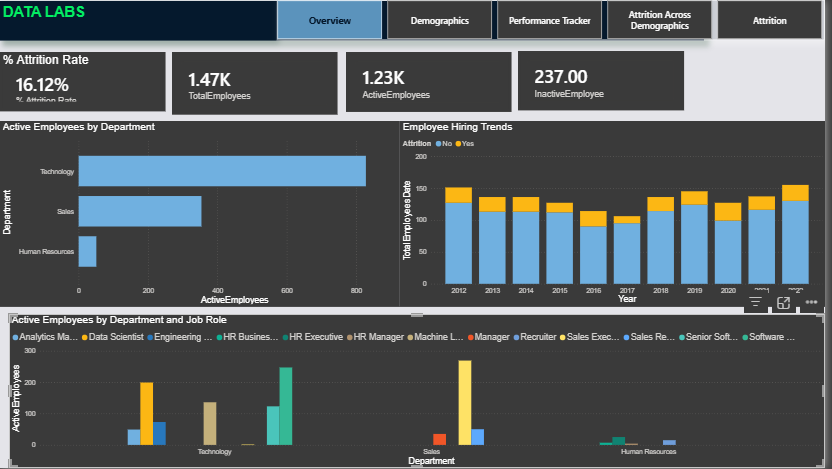
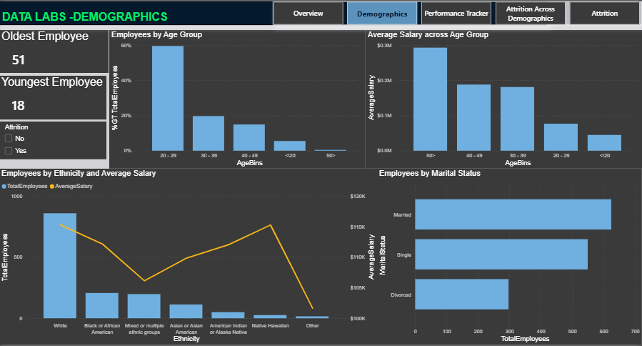
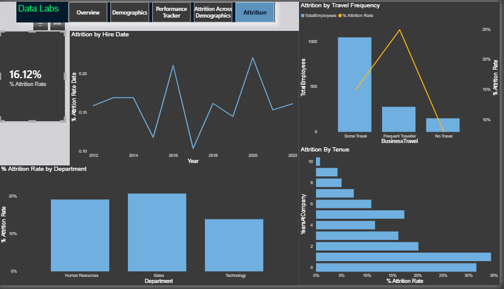

📊 HR Analytics & Employee Attrition Dashboard
Workforce Analytics | Attrition Analysis | Diversity & Inclusion | Performance Tracking | Power BI
________________________________________

# EXECUTIVE SUMMARY

The executive leadership of Atlas Labs requires visibilty into the workforce trends, attrition drivers metrics, and employee performance outcomes to support strategic workforce planning.

I developed an end-to-end Human Resource Analytics dashboard in Power BI that:

+ Identified a 16% overall attrition rate
+ Discovered that Sales Department's Sales Representative as the highest turnover role.
+ Found that frequent travelers experience a 24.9% attrition rate.
+ Enabled dynamic tracking of individuals performance review and ratings
+ Highlighted salary disparities across ethnic group.
+ Determined attrition across various categories, experiencing higher attrition across employees below 30 years of Age

The dashboard provides actionable insights to support retention strategy, DEI review and optmizing policies

-------------------------------------------------------------

# BUSINESS PROBLEM
The HR leadership needs answers to:

+ What is the true attrition rate?

+ Which department and roles have the highest turnover?

+ Does travel frequency influence attrition

+ Are there diversity representation or salary equity concerns

+ How can we track individual employee performance over time

+ How should HR prioritize rention efforts

    The challenge was transforming the raw CSV exports into a structured analytical model of answering executive-level workforce questions.

# Data & Modeling Approach
.PNG)

The solution was built using a dimensional modeling approach with a centralized fact table (FactPerformanceRating) and supporting dimensions (DimEmployee, DimDate, DimEducationLevel, etc.).

+ Star-schema inspired architecture

+ One-to-many relationships

+ Dedicated Date dimension for time intelligence

+ Separate measures table for DAX logic

+ Context-aware calculations to manage employee vs review-level granularity

The essence for this modelling approach is to ensures scalable analytics, optimized filter behavior, and accurate KPI reporting.

# KEY FINDINGS
## There was an attrition rate of 16%; meaning that out of 100 employees, 16 are likely to leave. This should be of a moderate concern

## It could be seeing that over 60% of employee are below the age of 30 while about  15% of employees are over the age of 40. 
In terms of earning Employees below age of 30 earns an average of $ 76000 while older employees earns high average salary of over $180,000

##  Built a dynamic individual performance tracker. This would help to determine the performance of individual employee. A selected employee taht received a rating of "Needs Improvement" while showing a declining satisfaction signals risk of future attrition

## Attrition was higher amongst employees below age of 30 and least amongst employees within age 30 - 40. 

## There was higher attrition amongst frequent travelers and amongst new employeees

